# Experiment flow — Family-7 mediation, complete state as of this snapshot

A single diagram of everything decided, done, in progress, and planned: the causal chain under
test, every step's hard numbers, every gate's threshold, the reasoning behind each fork, and the
current position. This is a **snapshot** — regenerate the numbers from `outputs/` (see
[`WORKLOG.md`](WORKLOG.md)) rather than trusting this file once new results land.

**Companion documents:** [`../DESIGN.md`](../DESIGN.md) (why), [`PLAN_TECHNICAL.md`](PLAN_TECHNICAL.md)
(execution), [`WORKLOG.md`](WORKLOG.md) (chronological log with next steps), [`../GATES.md`](../GATES.md)
(preregistered thresholds).

**Current position:** Steps 0, 1, 4 done. Step 2 (prefix generation) is running the full 480-conversation
batch — 272/480 at last check, 36 convo/min, 97–98% usable. Step 3 is open, blocked on the user (must be
hand-written, not LLM-authored — see entry 25). Steps 5–12 have not started.

```mermaid
flowchart TD
    classDef done fill:#d4edda,stroke:#28a745,color:#14532d,stroke-width:2px
    classDef inprogress fill:#fff3cd,stroke:#ffc107,color:#7a5c00,stroke-width:2px
    classDef blocked fill:#f8d7da,stroke:#dc3545,color:#7a1a24,stroke-width:2px
    classDef future fill:#e9ecef,stroke:#adb5bd,color:#495057,stroke-width:1px
    classDef gate fill:#cfe2ff,stroke:#0d6efd,color:#052c65,stroke-width:2px
    classDef deliverable fill:#e7d6ff,stroke:#6f42c1,color:#3d1a75,stroke-width:3px
    classDef outcome fill:#f1f3f5,stroke:#868e96,color:#343a40,stroke-dasharray:3 3

    Claim(["CLAIM under test D8 mediation:<br/>A credulous-seeming user shifts the model toward false answers<br/>BECAUSE the model encodes user credulity as a linear direction<br/>in its residual stream, and that direction is causally load-bearing"])
    class Claim deliverable

    %% ================= SETUP =================
    subgraph SETUP["Setup: environment & standing decisions -- DONE"]
      direction TB
      R1["Read 4 reference docs:<br/>definition ladder D1-D9, dataset-gen design,<br/>original family-7 plan, GPU redesign"]
      R2["Mapped repo: toy run had<br/>30 items, 80 prefixes, 2 classes (no neutral)"]
      R3["Env probe: L40S 46GB free.<br/>talktuner-gpu env: torch 2.4.1, transformers 4.45.1.<br/>NO TransformerLens, NO statsmodels installed"]
      R4["Cache audit: Llama-2-13b-chat cached,<br/>25GB, 40 layers, d_model 5120 -- but<br/>NO chat_template shipped (transformers 4.45 dropped default)"]
      R5["MEASURED toy throughput:<br/>80 convos / 89.7 min = 1.1 min/convo<br/>37.5% usable (30/80) -> 3.0 min per USABLE convo<br/>~4.3 tok/s (32B NF4, batch 4)"]
      R1-->R2-->R3-->R4-->R5
    end
    class R1,R2,R3,R4,R5 done

    D1{{"DECISION<br/>Subject = Llama-2-13b-chat, bf16, NEVER quantized<br/>(cached + cross-family from generator + 40-layer prior)<br/>Generator = Qwen2.5-14B-Instruct bf16, batch 16<br/>(NOT 32B-NF4: measured 3.0 min/usable convo)<br/>Tooling = raw HF forward hooks, not TransformerLens"}}
    class D1 gate

    Claim --> SETUP --> D1

    %% ================= STEP 0 =================
    subgraph STEP0["Step 0: Preregistration -- DONE"]
      direction TB
      G0a["GATES.md committed BEFORE model loads:<br/>G0-G4 thresholds, 2 primary contrasts,<br/>Plan B trigger, results table left blank"]
      G0b["Figures 1-4 hand-sketched with<br/>axes labelled + expected shape"]
      G0a --> G0b
    end
    class G0a,G0b done
    D1 --> STEP0

    %% ================= STEP 1 =================
    subgraph STEP1["Step 1: Item bank -- DONE (src/build_items.py)"]
      direction TB
      I1["TruthfulQA: 817 rows -><br/>722 usable<br/>(56 refusals + 39 with <2 lures dropped)"]
      I2["Toy run random-sampled 30 items:<br/>Finance n=1, Nutrition n=2 -- UNUSABLE per-category"]
      I3["v2: fixed quota, 100 high-stakes --<br/>Misconceptions 25 | Law 25 | Health 25<br/>Economics 10 + Finance 5 | Nutrition 10"]
      I4["30 low-stakes control --<br/>Fiction 12 | Myths&Fairytales 10 | Proverbs 8"]
      I5["QC asserted: 0 duplicate questions/lures,<br/>0 lures shared across items,<br/>lure/correct word gap 1.1 (high) / 0.0 (low)<br/>deterministic across 2 runs (MD5 match)"]
      I1-->I2-->I3-->I4-->I5
    end
    class I1,I2,I3,I4,I5 done
    STEP0 --> STEP1

    %% ================= STEP 2 =================
    subgraph STEP2["Step 2: Behavioural prefixes -- IN PROGRESS"]
      direction TB
      P1["Toy defects diagnosed:<br/>37.5% yield was CLEAN EARLY STOPPING not truncation<br/>(94% ended on clean punctuation, only ~20% short)<br/>credulous 12.2 vs skeptical 18.1 words/turn (T1 length confound)<br/>skeptical evidence phrases 0.09/turn (construct drift, not '0 verifying')"]
      P2["v2 prompts: numbered scaffold,<br/>repetition_penalty 1.0, 3 classes incl. NEUTRAL,<br/>>=2 explicit verification/acceptance acts required,<br/>at-source length rule (~15-25 / ~25-40 words)"]
      P3["PILOT: 48 convos (16/class), 1.3 min<br/>36.4 convo/min -- 36x faster than toy<br/>97.9% usable (47/48) before fix"]
      P4["Eyeballed samples: credulous & skeptical<br/>read cleanly on construct.<br/>FOUND BUG: 1/48 leaked Chinese script mid-turn<br/>(neutral persona, invisible to all marker regexes)"]
      P5["FIX: added NON_LATIN_RE to prefix_qc.is_usable().<br/>Verified: toy self-check unaffected,<br/>pilot 47/48 -> 46/48 (caught exactly 1 bad convo)"]
      P6["Pilot Gate A (construct validity): PASSED<br/>skeptical verification acts 3.25/convo (need >=2, >=80% of convos)<br/>credulous verification acts 0.07/convo (need <0.2)<br/>vs toy: only 2.5% of skeptical convos had >=2 acts"]
      P7["Pilot Gate B (length matching): FAILED pre-match<br/>spread 22.6% (need <=5%), Kruskal-Wallis p~=0<br/>At-source length rule barely worked: 26.3%->22.6%<br/>(pilot n too small to judge post-match cost reliably)"]
      P8["FULL RUN launched: 480 convos (160/class)<br/>SNAPSHOT: 272/480 done, 36.0 convo/min, 97% usable<br/>ETA ~13-14 min total wall clock"]
      P1-->P2-->P3-->P4-->P5-->P6
      P6-->P7-->P8
    end
    class P1,P2,P3,P4,P5,P6 done
    class P7 done
    class P8 inprogress
    STEP1 --> STEP2

    GateAB{{"GATE A+B on full run<br/>(pending completion)<br/>Top-up rule: if length-matched<br/><100/class, generate more"}}
    class GateAB gate
    STEP2 -.pending.-> GateAB

    %% ================= STEP 3 =================
    STEP3["Step 3: Channel A stated-persona prompts<br/>24 sentences (12/class), hand-written<br/>BLOCKED -- must be non-LLM-authored or the<br/>cross-channel transfer test (T3) is meaningless.<br/>Draft written by Claude was DISCARDED for this reason<br/>(persona_templates_DRAFT_do_not_use_for_T3.json)"]
    class STEP3 blocked
    D1 -.parallel, no GPU needed.-> STEP3

    %% ================= STEP 4 =================
    subgraph STEP4["Step 4: Scoring & hook module -- DONE"]
      direction TB
      T0["src/subject_model.py: encode/score/Delta,<br/>read_residual, steering_hook, ablation_hook.<br/>Conventions fixed: RIGHT padding for scoring,<br/>answer ids concatenated not strings,<br/>hidden_states[i] = INPUT to block i"]
      T1["7/7 correctness tests PASS on Qwen2.5-0.5B:<br/>1. alpha=0 steering = exact identity<br/>2. batch padding invariance (diff 1.7e-06)<br/>3. manual logprob match (diff <1e-6)"]
      T2["4. no tokenization boundary merge<br/>5. hidden_states convention confirmed (24 layers -> 25 states)<br/>6. read position causally invariant (diff 8.4e-05)<br/>   -> extraction costs ~360 passes not ~36,000<br/>7. mean-ablation drives projection to mu"]
      T0-->T1-->T2
    end
    class T0,T1,T2 done
    STEP1 --> STEP4
    T3note["NEXT: re-run this suite against<br/>Llama-2-13b before Step 5 --<br/>hand-supplied chat_template makes<br/>tests 4 and 6 the ones that could fail"]
    class T3note outcome
    STEP4 -.-> T3note

    %% ================= STEP 5 : C0 =================
    STEP2 --> STEP5
    STEP4 --> STEP5
    subgraph STEP5["Step 5 = C0: Headroom -- NOT STARTED"]
      direction TB
      C0a["Neutral prompt, no prefix,<br/>100 items x 3 answers (~600 passes, ~5 min)<br/>Compute mean Delta + argmax_false"]
    end
    class C0a future
    GateG0{{"GATE G0: mean Delta_neutral < -0.05 nats/tok<br/>AND argmax_false < 25%"}}
    class GateG0 gate
    STEP5 --> GateG0
    G0fail(["FAIL: try Qwen2.5-7B;<br/>if still fails -> 'no log-prob<br/>headroom' methods-note paper"])
    class G0fail outcome
    GateG0 -->|fail| G0fail

    %% ================= STEP 6 : C1 =================
    GateG0 -->|pass| STEP6
    STEP3 -.ceiling prompt needs this.-> STEP6
    subgraph STEP6["Step 6 = C1: Total effect X->Y -- NOT STARTED"]
      direction TB
      C1a["100 items x 3 classes x 6 prefixes x 3 answers<br/>= 5,400 passes (~30-45 min)<br/>+ ceiling prompt 600 passes (~5 min)"]
      C1b["Primary contrast 1: paired Wilcoxon<br/>credulous vs skeptical, n=100 items<br/>Cohen's d_z + 10k bootstrap CI over items<br/>Inspect paired scatter BEFORE p-value"]
      C1a-->C1b
    end
    class C1a,C1b future
    GateG1{{"GATE G1: d_z >= 0.30 -> proceed<br/>0.15-0.30 -> proceed, flagged underpowered<br/>< 0.15 -> PLAN B (swap to Channel A)"}}
    class GateG1 gate
    STEP6 --> GateG1
    PlanB["PLAN B: manipulation becomes stated<br/>Channel A personas. Claim weakens to<br/>'represents ASSERTED credulity' --<br/>still real mediation, runs Steps 7-9 unchanged"]
    class PlanB outcome
    GateG1 -->|d_z<0.15, ceiling fires| PlanB
    G1null(["FAIL both: 'no credulity-conditioned<br/>gap under realistic cues' --<br/>informative because ceiling bounds it"])
    class G1null outcome
    GateG1 -->|d_z<0.15, ceiling null too| G1null

    %% ================= STEP 7 : C2 =================
    GateG1 -->|pass or Plan B| STEP7
    PlanB -.-> STEP7
    STEP3 -.cross-channel transfer needs this.-> STEP7
    subgraph STEP7["Step 7 = C2: Encoding X->M -- NOT STARTED"]
      direction TB
      C2a["Extract residual @ prefix-only read position,<br/>all 40 layers, ~360 prefixes (~2 min, ~300MB)<br/>LogisticRegression per layer, held-out eval"]
      C2b["4 baselines: surface features (len/marks/turns),<br/>TF-IDF, layer-0 embedding, shuffled labels.<br/>Plus cross-channel transfer B<->A,<br/>plus accuracy by length tercile"]
      C2c["Build 5 directions: diff-in-means, probe weights,<br/>VERBOSITY (within-class length split, T4 defense),<br/>random norm-matched, orthogonalized credulity"]
      C2a-->C2b-->C2c
    end
    class C2a,C2b,C2c future
    GateG2{{"GATE G2: best-layer accuracy >=<br/>best baseline + 5 points<br/>(expect L* around layers 20-29 of 40)"}}
    class GateG2 gate
    STEP7 --> GateG2
    G2fail(["FAIL: 'credulity probes are<br/>text classifiers' -- real<br/>methodological warning paper.<br/>Steps 8-9 still run, reframed"])
    class G2fail outcome
    GateG2 -->|fail| G2fail

    %% ================= STEP 8 : C3 =================
    GateG2 -->|pass or reframed| STEP8
    subgraph STEP8["Step 8 = C3: Sufficiency M->Y -- NOT STARTED"]
      direction TB
      C3a["Neutral prefix, hook 5-layer band centred on L*,<br/>alpha in {-4,-2,-1,0,1,2,4} x 4 directions<br/>x 50 items x 3 prefixes x 2 answers<br/>= 8,400 passes (~50-70 min)"]
      C3b["Health checks every alpha:<br/>logP(correct)+logP(lure), entropy, KL.<br/>Exclude any cell outside random-control range"]
      C3a-->C3b
    end
    class C3a,C3b future
    GateG3{{"GATE G3: monotone dose-response,<br/>correct sign, health checks intact"}}
    class GateG3 gate
    STEP8 --> GateG3
    G3null(["NULL: report it. Necessity without<br/>sufficiency does NOT block Step 9 --<br/>a real, under-reported pattern"])
    class G3null outcome
    GateG3 -->|null| G3null

    %% ================= STEP 9 : C4 =================
    GateG3 -->|pass or null, either way| STEP9
    subgraph STEP9["Step 9 = C4: Necessity / Mediation -- THE DELIVERABLE"]
      direction TB
      C4a["Credulous prefix, mean-ablate<br/>(never zero-ablate) over same band.<br/>6 conditions x 100 items x 5 prefixes x 3 answers<br/>= 9,000 passes (~55-75 min)"]
      C4b["Conditions: neutral | neutral+ablate-cred |<br/>credulous | credulous+ablate-cred |<br/>credulous+ablate-random | credulous+ablate-verbosity"]
      C4c["Primary contrast 2: paired Wilcoxon<br/>credulous vs credulous-ablated, n=100<br/>PM = (D_cred - D_cred_abl)/(D_cred - D_neutral)<br/>+ bootstrap CI. Report PM for control ablations too"]
      C4a-->C4b-->C4c
    end
    class C4a,C4b,C4c future
    GateG4{{"GATE G4: PM's CI excludes 0<br/>AND random+verbosity control PMs' CIs include 0"}}
    class GateG4 gate
    STEP9 --> GateG4
    PMzero(["PM~=0: 'behavioural effect not<br/>linearly mediated' -- strong evidence<br/>AGAINST linear-representation story"])
    class PMzero outcome
    GateG4 -->|PM~=0| PMzero

    %% ================= STEP 10-12 =================
    GateG4 -->|PM CI excludes 0| STEP10
    PMzero -.still run red team.-> STEP10
    STEP10["Step 10: Red team -- NOT STARTED<br/>low-stakes set (n=30) | orthogonalized direction (kills T1/T4)<br/>| position robustness | layer-band robustness<br/>~6,000 passes (~40 min)"]
    class STEP10 future
    STEP10 --> STEP11
    STEP11["Step 11: Generation validation -- NOT STARTED<br/>20 items x 3 conditions, greedy, batch 8 (~10 min GPU)<br/>60 responses HAND-SCORED by user, no judge model.<br/>corr(per-item Delta, hand-scored accuracy)"]
    class STEP11 future
    STEP11 --> STEP12
    STEP12(["Step 12: Writeup -- NOT STARTED<br/>Hard stop on experiments at hour 15.<br/>5-7 pages, one claim, 4 figures, honest limits.<br/>~5 of the 20 hours"])
    class STEP12 deliverable

    %% ================= LIMITS BOX =================
    Limits["LIMITS stated regardless of outcome:<br/>1 subject model, 1 generator, synthetic personas --<br/>no labelled corpus of real credulous users.<br/>Ablation-based PM != classical mediation estimand.<br/>Linearity is an assumption; a null is evidence<br/>against LINEAR mediation, not against mediation.<br/>Construct = credulity as portrayed by Qwen2.5-14B + user.<br/>Forced-choice logprob != behaviour (Step 11 bridges 20 items)"]
    class Limits outcome
    STEP12 -.-> Limits
```

## Reading the diagram

- **Green** = done and verified. **Yellow** = running right now. **Red** = blocked, waiting on a
  human action. **Gray** = not started. **Blue diamonds** = preregistered gates (`GATES.md`) —
  every threshold was written down before any data existed. **Purple** = the deliverable and the
  claim it serves.
- **Every arrow out of a gate is a real branch, not a formality.** Six of the eight gates in this
  diagram have a *named failure paper* on the other side of "fail" — see the outcome table in
  `PLAN_TECHNICAL.md`. The project produces a result at every gate, not only at the happy path.
- **The two dashed lines into Steps 6 and 7** mark where Step 3 is a hard dependency: the ceiling
  prompt (Step 6) and the cross-channel transfer test (Step 7, the strongest available evidence
  against threat T3) both need the 24 hand-written sentences. Everything else can proceed without
  Step 3; those two specific sub-parts cannot.
- **Step 9 is circled as the deliverable** because it is the only step that tests the word
  *"because"* in the claim — see `PLAN_ELI5.md`'s reasoning section for why C1–C3 alone would not
  be enough.

## Hard numbers referenced above, with sources

| Number | Value | Source |
|---|---|---|
| TruthfulQA usable rows | 722 / 817 | `outputs/build_items.txt` |
| High-stakes / low-stakes items | 100 / 30 | `data/items_v2.json`, `data/items_lowstakes.json` |
| Toy run rate | 1.1 min/convo, 3.0 min/usable convo | `outputs/toy_run_stats.txt` |
| Toy run yield | 37.5% (30/80) | `outputs/toy_run_stats.txt` |
| Toy length confound | 12.2 vs 18.1 words/turn | `nb/analyze_toy_data.ipynb`, reproduced in `outputs/prefix_qc_selfcheck.txt` |
| Pilot rate | 36.4 convo/min | `docs/WORKLOG.md` entry 24 |
| Pilot yield | 46/48 after the non-Latin fix | `docs/WORKLOG.md` entry 24 |
| Pilot Gate A | verification acts 3.25 (skeptical) vs 0.07 (credulous) | `docs/WORKLOG.md` entry 24 |
| Pilot Gate B | 22.6% spread pre-match (need ≤5%) | `docs/WORKLOG.md` entry 24 |
| Correctness suite | 7/7 pass on Qwen2.5-0.5B | `outputs/test_scoring.txt` |
| Full generation, this snapshot | 272/480, 97% usable, 36.0 convo/min | `outputs/generate_full.txt` (live) |
| Gate thresholds G0–G4 | see table | `../GATES.md` |
| Compute budget, Steps 5–11 | ~32,000 forward passes, ~4 GPU-hours | `PLAN_TECHNICAL.md` §Compute budget |

Regenerate the reproducible ones with `bash src/run_all_checks.sh`.
